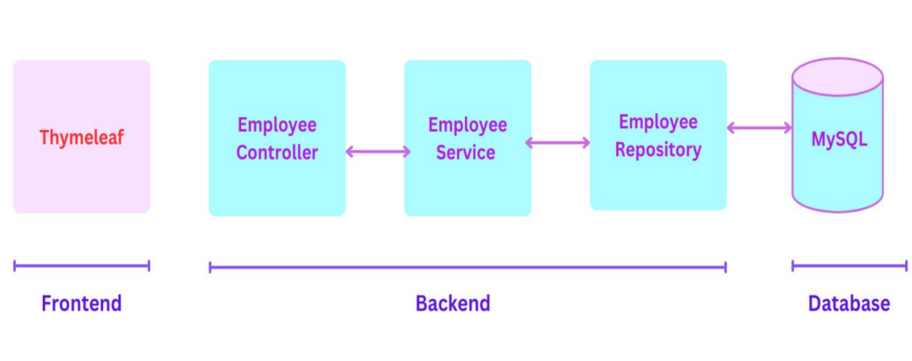
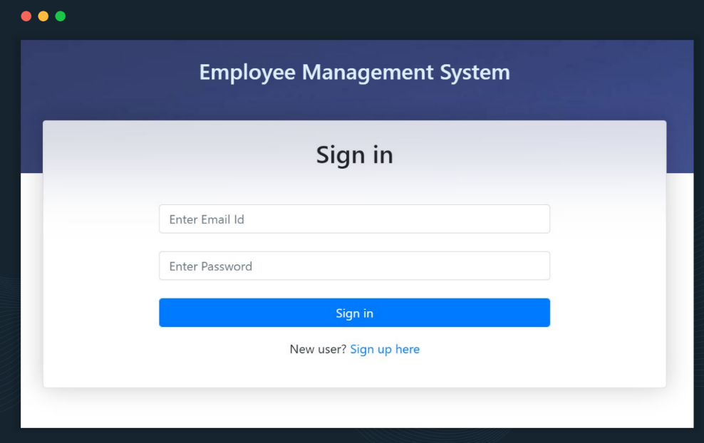
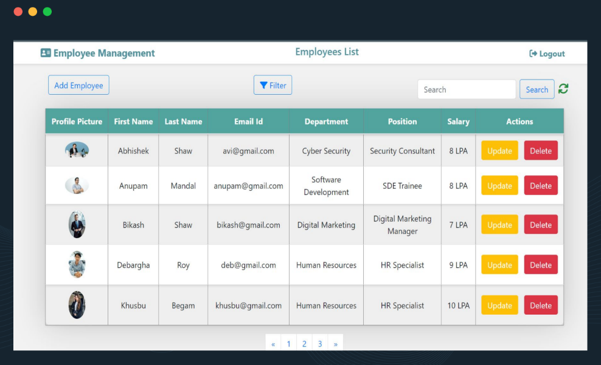

# Employee Management System

## Overview

The Employee Management System is a Java Spring Boot-based web application designed to provide a user-friendly platform for effective employee administration. The system incorporates essential features for managing employee data, including user authentication, employee addition, modification, deletion, filtering, searching, pagination, sorting, and the capability to upload and display profile pictures.

## Technologies Used

### Backend
- **Java**: The core programming language for developing the backend logic.
- **Spring Boot**: A framework for building Java-based enterprise applications.
- **Spring Data JPA**: Used for data access and manipulation.
- **Spring Security**: Implemented for secure user authentication and registration.
- **JSP (JavaServer Pages)**: Used for creating dynamic web pages.

### Database
- **MySQL**: The relational database management system used for storing employee data.

### Frontend
- **HTML**: Markup language for structuring the frontend content.
- **CSS**: Styling language for enhancing the visual appeal of the application.
- **Bootstrap**: Frontend framework for responsive and attractive styling.
- **Thymeleaf**: Template engine for creating dynamic content on the frontend.

## System Architecture

## Key Features

1. **User Authentication:** Implemented a secure registration and login system using Spring Security.
2. **Add Employee:** User-friendly interface for effortlessly adding new employees.
3. **Edit Employee:** Easy-to-use functionality for updating and modifying existing employee details.
4. **Delete Employee:** Simple process for users to delete employee records.
5. **Filtering:** Allows users to filter employee data by department and position.
6. **Searching:** Provides a quick and efficient search feature for finding specific employee data.
7. **Pagination:** Enables easy navigation between pages for efficient data handling.
8. **Sorting:** Allows quick organization and analysis of employee data.
9. **Profile Pictures:** Capability to upload and display employee profile pictures.

## User Interface Screenshots

### Sign-in Page

### Employee List

## Demo

[Demo Video](https://drive.google.com/file/d/1JopULCDc47INpxGzwDtKSXCa5mZ284Dn/view)

